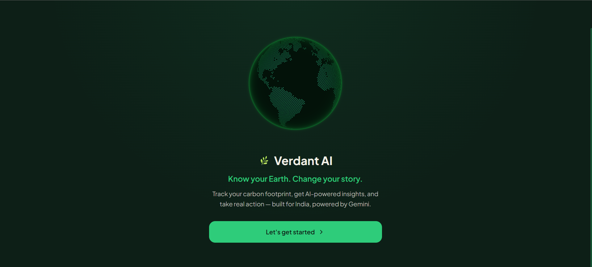
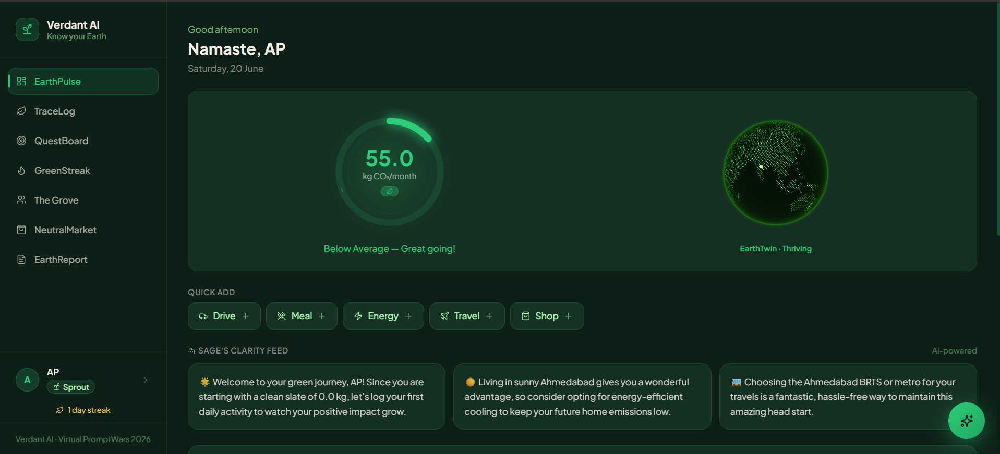

# Verdant-AI: Carbon Footprint Awareness Platform 🌱

**Live Demo:** [https://verdant-ai-web-pbjag56qea-uc.a.run.app](https://verdant-ai-web-pbjag56qea-uc.a.run.app)

**Built for [PromptWars Virtual Hackathon](https://promptwars.in/promptwarsVirtual.html)** 🚀

**Challenge 3:** Design a solution that helps individuals understand, track, and reduce their carbon footprint through simple actions and personalized insights.

Verdant-AI is a comprehensive platform designed to turn climate anxiety into actionable, gamified progress. It helps users **understand** their baseline, **track** daily emissions with natural language logging, and **reduce** their impact through AI-driven coaching and personalized weekly quests.

## 📸 Screenshots


*Initial onboarding and setup screen.*


*Main dashboard showing carbon footprint tracking, Sage AI coach, and EarthReport.*

## 🌟 Key Features

* **End-to-End Individual Footprint Flow:** A seamless 5-step onboarding process establishes a baseline, leading into a dashboard that ties every interaction to the "understand, track, reduce" loop.
* **EcoCoach (Sage):** An intelligent, context-aware AI assistant powered by Google Gemini. Sage analyzes your logs, injects category data, and dynamically updates recommendations whenever a new activity is logged.
* **EarthTwin 3D Visualization:** A dynamic, WebGL-powered 3D globe that acts as a visual representation of your "GreenScore", visually thriving or degrading based on your monthly carbon footprint versus regional benchmarks.
* **Gamification & Weekly Quests:** Users build streaks, earn XP, and complete AI-generated weekly quests tailored to their highest emission categories.

## 🏗️ Architecture & Code Quality

Our architecture is designed for maintainability, security, and scalability:
* **Consistent Structure:** Clear separation of concerns with a distinct service/router split for backend APIs.
* **Type Safety & Linting:** Strictly typed schemas, enforced by ESLint on the frontend and Ruff on the backend.
* **Security First:** Implements bcrypt for password hashing, `httpOnly` cookies for JWTs, input validation, strict CORS policies, and secrets management via GCP Secret Manager.
* **Efficiency:** Lean Docker images, database indexing for rapid query performance, cached `ImpactLens` insights to reduce API overhead, and a robust Gemini 2.5 Flash implementation (with a fallback to Flash-Lite to guarantee uptime).

## 🚀 Getting Started

The platform features a demo account flow so you can test the entire experience in under 5 minutes without needing complex setup.

### Prerequisites
* Node.js 20+
* Python 3.11+ (for API services)
* Docker (for containerized deployment)

### Local Development
1. **Clone & Install:**
   ```bash
   npm install
   ```
2. **Environment Setup:**
   Copy `.env.example` to `.env` and add your Google Gemini API key.
3. **Run Dev Server:**
   ```bash
   npm run dev
   ```
4. **Access the App:** Open `http://localhost:5173` in your browser.

## ♿ Accessibility
Verdant-AI is built with inclusivity in mind:
* Semantic HTML forms and clear focus states.
* High color contrast ratios (with a tailored dark theme).
* Text alternatives for all chart data and visualizations.
